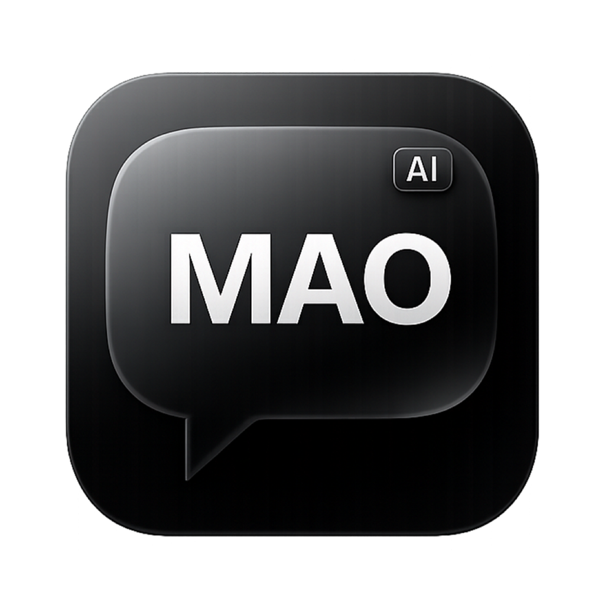

  

<h1 align="center">MAO AI</h1>

  <strong>L'Assistant Personnel & Intelligence Artificielle Unifiée pour macOS</strong> 
  <em>Système PRO • Design Avancé • Confidentialité Maximale</em>

  <a href="#-téléchargement--installation">Télécharger la dernière version</a> •
  <a href="#-fonctionnalités-clés">Découvrir les fonctionnalités</a> •
  <a href="#-architecture--sécurité">Sécurité</a>

---

## 💡 Présentation de MAO AI

**MAO AI** est bien plus qu'un simple client de chat. C'est un véritable **système d'exploitation cognitif** intégré directement à macOS. Développée avec React et Electron, cette application fusionne les modèles d'Intelligence Artificielle les plus puissants au monde avec une interface bureau native ultra-réactive. 

Conçue pour les professionnels, les développeurs et les créatifs, MAO AI élimine la friction entre l'humain et l'IA avec un design sombre minimaliste, des animations fluides et des outils de productivité avancés.

---

## 🚀 Fonctionnalités Clés

### 🧠 Moteur Multi-Modèles Dynamique
Ne soyez plus limité à une seule IA. MAO vous permet de basculer instantanément (et même de combiner) les meilleurs modèles du marché en fonction de votre tâche.
- **MAO Gladiator :** Optimisé pour le code, la structure et la logique complexe.
- **MAO Nova :** Orienté vers la rédaction, la créativité et la nuance linguistique.
- **MAO Spectra PRO :** Le modèle d'élite pour le raisonnement profond et l'analyse de bout en bout.
- Intégration transparente : Groq (vitesse instantanée), Gemini, et traitement open-source.

### 👁️ MAO Vision & Health Nexus
La compréhension visuelle poussée à son paroxysme.
- **Analyse Visuelle Standard :** Glissez-déposez n'importe quel document, capture d'écran ou facture, MAO AI en extraira le contexte et les détails instantanément.
- **⚕️ Health Nexus (Module Santé) :** Déposez une photo de votre repas. L'IA clinique de MAO AI identifiera les aliments, estimera les portions, et générera un tableau macro-nutritionnel complet (Calories, Protéines, Glucides, Lipides) avec un score de santé basé sur les bases de données CIQUAL/USDA.

### 🎨 Imagine Studio & Lightbox
Un studio de création graphique intégré.
- Générez des images époustouflantes (modèles **Flux**, **Zimage**, **Pix**).
- **Imagine Gallery :** Retrouvez toutes vos générations dans une galerie privée, stockée localement.
- **Lightbox PRO :** Visualisez vos images en plein écran, copiez le prompt original via l'intégration native au presse-papiers macOS, et exportez en haute résolution en un clic.

### 💾 Système de Mémoire Continue (Auto-Facts)
L'IA qui apprend à vous connaître. MAO AI analyse silencieusement vos conversations pour en extraire des **faits clés** sur vos préférences (langages de code préférés, objectifs, contexte pro). Ces faits sont stockés *uniquement sur votre machine* en SQLite et réinjectés dans le contexte pour des réponses ultra-personnalisées.

### ⚡ Vitesse et Intégration Native macOS
- **AirDrop & Drag-and-Drop :** Balancez un fichier depuis votre iPhone en AirDrop, MAO le réceptionne et le convertit silencieusement (ex: HEIC vers JPEG) avant de l'analyser.
- **Synthèse Vocale (TTS) Native :** L'application utilise la commande `say` native du noyau macOS pour vous lire les réponses sans aucune latence serveur.
- **Widgets Intégrés :** Météo en direct, Heures de prières géolocalisées, et suivi des Finances intégrés dans la sidebar.
- **Autocorrection & Fallbacks :** Système d'autocorrection intelligent et bascule automatique sur des serveurs de secours si un fournisseur API tombe en panne. L'appli ne vous laisse jamais tomber.

---

## 🔒 Architecture & Sécurité

Votre vie privée est le fondement de MAO AI. Contrairement aux solutions Cloud grand public :
- **Local-First :** Vos historiques de chat, votre base de données Mémoire (SQLite), et votre galerie d'images sont stockés **physiquement et uniquement** sur le disque dur de votre Mac.
- **No Tracking :** L'application ne contient ni traceurs, ni télémétrie commerciale.
- **Fichiers Locaux :** MAO AI accède à vos fichiers uniquement pour le contexte du chat en cours, et les traite de manière éphémère.

---

## 📥 Téléchargement & Installation

L'application installe ses mises à jour toute seule une fois installée. Pour la première installation :

1. Rendez-vous dans la section **[Releases](https://github.com/yani2298/mao-releases/releases/latest)**.
2. Téléchargez l'archive `.dmg` qui correspond au processeur de votre Mac :
   - 🍏 **Puces Apple Silicon (M1, M2, M3, M4) :** Téléchargez `MAO-AI_[version]_arm64.dmg`
   - 💻 **Puces Intel :** Téléchargez `MAO-AI_[version]_x64.dmg`
3. Ouvrez le `.dmg` et glissez l'icône de MAO AI dans le dossier **Applications**.
4. **⚠️ Sécurité macOS :** Puisque MAO est distribué librement en dehors de l'App Store, macOS bloquera le premier lancement. Faites un **Clic-Droit > Ouvrir** sur l'application, puis cliquez sur "Ouvrir" dans la boîte de dialogue.

### 🔄 Mises à jour automatiques
Une fois MAO AI installée, vous n'avez plus rien à gérer. L'application vérifie silencieusement les nouvelles versions au démarrage. Lorsqu'une mise à jour de fonctionnalité est prête, une discrète bannière verte apparaîtra en bas de l'écran pour vous proposer d'installer la nouvelle version en un clic.

---

## 🛠 Données Techniques (Pour les curieux)

*   **Stack UI :** React 19, Tailwind CSS, Lucide Icons, Framer Motion
*   **Core Systems :** Electron, Node.js, SQLite3 (better-sqlite3)
*   **Orchestration IA :** LangChain, Groq SDK, Google Gen AI
*   **Bypass & IPC :** ContextBridge sécurisé, Multi-Threaded Process
*   **Créateur :** Anis Mosbah

   
  <em>Designé et assemblé sur macOS en 2026. L'outil ultime pour repousser les limites de votre productivité.</em>

